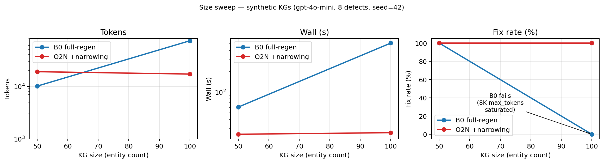

# json-correction-loop

> A Python library for **iteratively correcting large LLM-generated JSON
> and knowledge graphs** via **RFC 6902 patches** and a **multi-agent
> sub-task** stack (`path_finder`, context narrowing, request validator,
> patch evaluator). Composable critic loop with convergence policies.
> Works with **OpenAI**, **Anthropic**, **OpenRouter**.

[](https://pypi.org/project/json-correction-loop/)
[](https://pypi.org/project/json-correction-loop/)
[](https://pypi.org/project/json-correction-loop/)
[](LICENSE)
[](https://github.com/warpspaceinc/json-correction-loop/actions/workflows/ci.yml)
[](https://github.com/warpspaceinc/json-correction-loop/discussions)
[](#status)

**TL;DR.** When an LLM regenerates a 100-entity / 183-edge JSON
knowledge graph on critic feedback (the prevailing "full-regen"
pattern), `gpt-4o-mini` fixes **0 / 8** flagged defects and burns 73K
tokens. This library — a critic loop with surgical RFC 6902 patching
and sub-agent decomposition — fixes **8 / 8** at 17K tokens.



## Why this exists

When an LLM produces a large JSON artifact — an agent's memory, a
generated knowledge graph, a structured config tree, a multi-step
plan — the prevailing pattern is to **re-emit the entire object on
every critic pass**. This is a problem.

We measured it: on a synthetic 100-entity / 183-edge knowledge graph,
`gpt-4o-mini` saturates its 8K `max_tokens` ceiling mid-array, returns
truncated JSON, and across five hardcapped loop iterations **fixes 0
of 8 critic-flagged defects** while burning 73K tokens and 8.5 minutes
of wall clock.

```
size=100 (100 entities, 183 edges, 8 defects):
  full-regen baseline:    fix=0%   tokens=73,740   wall=435s
  this library (O2N):     fix=100% tokens=17,117   wall=26s
```

Surgical patching alone isn't enough either: a naive RFC 6902 patcher
inside a critic loop only fixes 35–64% of defects, because the LLM
acts on critic-flagged *symptoms* (an edge with the wrong predicate)
rather than *root causes* (the entity whose type was actually
flipped). Closing that gap requires sub-agents.

## What this library is

A composable `gather → plan → execute` loop with five domain-pluggable
slots:

- **Critics** (you supply) report defects against stable item IDs
  (JSON pointers, entity IDs).
- **`path_finder`** maps each critic-flagged symptom pointer to its
  root-cause pointer.
- **Context narrowing** scopes both the sub-agent and the patcher to
  the slice of state implicated by flagged paths — turns out to be a
  *correctness* component, not just a cost optimization (we measured
  this; see [Discussion #1][disc1]).
- **Surgical patcher** emits RFC 6902 ops via tool calling, applied
  through a minimal inline RFC 6902 implementation
  (`add`/`replace`/`remove` only — `move`/`copy` are rejected by
  design).
- **Convergence policies** (quality-stable, hardcap) compose as
  Protocols.

The library imports no specific LLM client, persistence layer, or
event sink. Storage backends and event sinks are Protocols you plug
in.

[disc1]: https://github.com/warpspaceinc/json-correction-loop/discussions/1

## Install

```bash
pip install json-correction-loop
```

Requires Python 3.11+. Runtime dependencies:

- `pydantic>=2.0` — models / structured output.
- `jq>=1.6` — used by `SurgicalPatcher`'s `jq` tool for bulk graph
  queries. PyPI wheels ship libjq; no system `jq` needed.
- `mini-racer>=0.12` — embedded V8 used by `SurgicalPatcher`'s
  `javascript` tool. No Node.js needed.

For development:

```bash
git clone https://github.com/warpspaceinc/json-correction-loop
cd json-correction-loop
pip install -e ".[dev]"
pytest
```

## Quickstart

The smallest end-to-end example wires fakes through the full loop —
no LLM required — to show how the pieces compose:

```python
from json_correction_loop import (
    CorrectionLoopConfig,
    CriticIssue, CriticReport,
    ExecuteResult,
    make_callback_executor,
    make_identity_planner,
    run_correction_loop,
)

# 1. Define your state and a critic.
state = {"items": [{"id": "a", "ok": False}, {"id": "b", "ok": True}]}

def gather(state, iteration, model):
    issues = [
        CriticIssue(
            target_id=f"/items/{i}/ok",
            severity="major",
            issue_type="needs_fix",
            description=f"set ok=True on item {item['id']}",
        )
        for i, item in enumerate(state["items"]) if not item["ok"]
    ]
    return [CriticReport(issues=issues, score=10 if not issues else 4)]

# 2. Define an executor that applies one correction at a time.
def apply_one(state, flagged_paths, feedback_by_path, model):
    traces = []
    for path in flagged_paths:
        # In production this is your LLM patcher; here we just patch.
        idx = int(path.strip("/").split("/")[1])
        state["items"][idx]["ok"] = True
        traces.append(type("T", (), {
            "id": f"t-{idx}", "requirement_id": path,
            "addressed": True, "reason": "set ok=True",
        })())
    return traces

# 3. Run the loop.
def parse(issues):
    return ([iss.target_id for iss in issues],
            {iss.target_id: iss.description for iss in issues})

cfg = CorrectionLoopConfig(level="items", max_loops=5)
ok = run_correction_loop(
    state, cfg,
    gather_fn=gather,
    plan_fn=make_identity_planner(parse),
    execute_fn=make_callback_executor(apply_one),
)
assert ok and all(item["ok"] for item in state["items"])
```

For a real LLM-driven example with a knowledge-graph correction
workload, see `examples/kg_correction/` and `tests/test_loop.py`.
The end-to-end ablations (full-regen vs single-shot patch vs full
sub-agent stack) and size-sweep numbers are documented in
[EXPERIMENTS.md](EXPERIMENTS.md).

## What's inside

### Core

| Module | Purpose |
|--------|---------|
| `json_correction_loop.loop`         | The `run_correction_loop` driver |
| `json_correction_loop.models`       | `Correction`, `CorrectionPlan`, `CriticIssue`, `CriticReport` |
| `json_correction_loop.planners`     | Identity + oscillation-aware planners |
| `json_correction_loop.executors`    | `make_callback_executor` factory |
| `json_correction_loop.convergence`  | `QualityStablePolicy`, `HardcapPolicy` |
| `json_correction_loop.events`       | `EventSink` Protocol + `NullEventSink` |
| `json_correction_loop.storage`      | `StorageBackend` Protocol + `NullStorageBackend` |

### Sub-agents

| Module | Sub-agent | Status |
|--------|-----------|--------|
| `json_correction_loop.path_finder`        | Symptom → root cause pointer redirect | Stable |
| `json_correction_loop.template_filler`    | Empty-container enumeration filler | Stable |
| `json_correction_loop.request_validator`  | Reject malformed patch requests upstream | Stable |
| `json_correction_loop.patch_evaluator`    | Score patches against intent before commit | Stable |
| `json_correction_loop.patcher`            | Surgical RFC 6902 patcher | Stable |

## Status

- **Alpha (v0.1.0)** — published on
  [PyPI](https://pypi.org/project/json-correction-loop/).
  Public API may change before 1.0; release notes in
  [CHANGELOG.md](CHANGELOG.md).
- Domain-neutral library — bring your own critic, patcher prompt,
  and storage backend.

## Experiments

Design choices are measured on a synthetic knowledge-graph
perturbation benchmark.

**Headline.** At 100 entities, full-regeneration achieves 0% fix rate;
the full library stack achieves 100% at ~5× fewer tokens.

**Ablation at size=100** (each component is load-bearing):

| Cond | path_finder | narrowing | Fix% | Drift | Tokens |
|---|:---:|:---:|---|---|---|
| B0 (full-regen) | n/a | n/a | 0% | 8 | 73,740 |
| O1 (loop+patch) | no | no | 35% | 23 | 42,621 |
| O1N | no | yes | 57% | 13 | 14,392 |
| O2 | yes | no | *JSON parse error* | — | — |
| **O2N (full)** | **yes** | **yes** | **100%** | **6** | **17,117** |

Full setup, condition definitions, per-seed variance, and reproduction
recipe in [EXPERIMENTS.md](EXPERIMENTS.md). Long-form design rationale
including failure-mode case studies in [Discussion #1][disc1].

## Community

- 🗣️ [Discussions](https://github.com/warpspaceinc/json-correction-loop/discussions)
  — design questions, "does this work for my domain?" threads, show & tell.
- 🐛 [Issues](https://github.com/warpspaceinc/json-correction-loop/issues)
  — bug reports + feature requests.
- 📦 [PyPI](https://pypi.org/project/json-correction-loop/)

## Contributing

Issues and PRs welcome. Please run `pytest` and `ruff check src tests
examples` before submitting. CI runs both on Python 3.11 and 3.12.

## License

Apache-2.0. See [LICENSE](LICENSE).
